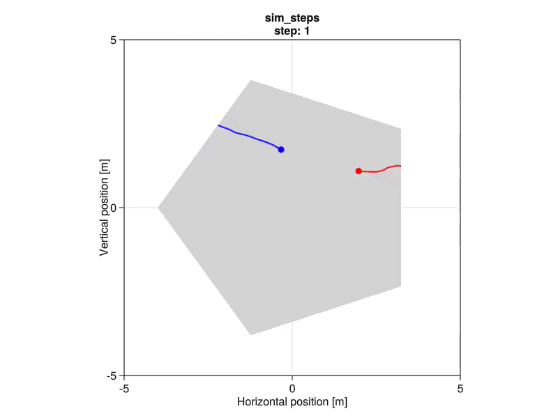

# LiftedTrajectoryGames

[](https://github.com/lassepe/LiftedTrajectoryGames.jl/actions/workflows/ci.yml)
[](https://codecov.io/gh/lassepe/LiftedTrajectoryGames.jl)
[](https://opensource.org/licenses/MIT)

A reference implementation of the lifted game solver presented in our RSS 2022 paper ["Learning Mixed Strategies in Trajectory Games"](https://arxiv.org/pdf/2205.00291.pdf).

Please consult [project website](https://lasse-peters.net/pub/lifted-games) for more information on this project.

[](https://arxiv.org/pdf/2205.00291.pdf)

```bibtex
@inproceedings{peters2022rss,
    title     = {Learning Mixed Strategies in Trajectory Games},
    author    = {Peters, Lasse and Fridovich-Keil, David and Ferranti, Laura and Stachniss, Cyrill and Alonso-Mora, Javier and Laine, Forrest},
    booktitle = {Proc.~of Robotics: Science and Systems (RSS)},
    year      = {2022},
    url       = {https://arxiv.org/abs/2106.03611}
}
```


## Teaser: Learning to solve a game of tag from scratch in receding-horizon self-play.



## Installation

To install LiftedTrajectoryGames, simply add it via Julia's package manager from the REPL:

```julia
# hit `]` to enter "pkg"-mode of the REPL
pkg> add LiftedTrajectoryGames
```

## Usage

LiftedTrajectoryGames uses [TrajectoryGamesBase](https://github.com/lassepe/TrajectoryGamesBase.jl) as an abstraction of the problem and solver interface for trajectory games. Please to refer to that package for documentation on the problem setup. Note that the lifted game solver **requires differentiability of the game's costs and dynamics**.

### Solver Setup

For a game that meets those assumptions, you can construct a `solver::LiftedTrajectoryGameSolver` using the helper constructor that recovers the relevant solver parameters (network input/output dimensions etc.) from a given `game::TrajectoryGame`. Note that the solver construction may take a while as it compiles all the relevant functions and derivatives for acceleration of downstream solver invocations.

> :warning: Please refer to the docstrings of each type and function for more information.
> For example, type `?LiftedTrajectoryGameSolver` in the REPL for more information on solver options.

```julia
using LiftedTrajectoryGames
using TrajectoryGamesBase
using TrajectoryGamesExamples

# place holder; replace with your actual game constructor
game = two_player_meta_tag()
planning_horizon = 20
# the number of "pure" trajectories to mix over for each player:
n_actions = [2 for _ in 1:num_players(game)]
solver = LiftedTrajectoryGameSolver(game, planning_horizon; n_actions)
```

### Solver Invocation

#### Open-Loop Planning

Once you have set up the solver, you can invoke it for a given `initial_state`.

```julia
using BlockArrays: mortar
initial_state = (mortar([rand(4) for _ in 1:num_players(game)]) .- 0.5) * 4
# You will notice that the first invocation of this function is very slow because Julia has to compile a lot of code.
# After all the compilation is done, subsequent invocations of this method should be blazingly fast. (on the order of milliseconds).
strategy = solve_trajectory_game!(solver, game, initial_state)
```

The resulting *mixed* joint `strategy` can then be invoked on the state to compute `controls` for all players.

```julia
# A strategy may be time-varying. Therefore, we also have to hand in the time.
time = 1
controls = strategy(initial_state, time)
```

#### Receding-Horizon Planning

In practice, you may also wish to use the solver in the framework of model-predictive game play (MPGP), i.e., for receding-horizon invocations rather than the generation of open-loop plans.
To this end, you can wrap the solver in a `receding_horizon_strategy::TrajectoryGamesBase.RecedingHorizonStrategy`.

```julia
receding_horizon_strategy = RecedingHorizonStrategy(; solver, game, turn_length = 5)
```

This strategy will invoke the solver on demand upon invocation for a given state and time, `receding_horizon_strategy(state, time)`.
Therefore, you can directly pass this `receding_horizon_strategy` to the `TrajectoryGamesBase.rollout` function for a receding-horizon online rollout:

```julia
number_of_sumulation_steps = 500
simulation_steps = rollout(
    game.dynamics,
    receding_horizon_strategy,
    initial_state,
    number_of_sumulation_steps;
    # here, we also record the strategy at each time step for visualization below
    get_info = (strategy, x, t) -> strategy.receding_horizon_strategy,
)
```

### Visualization

TrajectoryGamesExamples additionally provides the function `animate_sim_steps` to visualize the resulting `simulation_steps` sequence using Makie.

```julia
# activate the GLMakie backend to render on a GPU-accelerated canvas.
# Loading this package may take a while.
using GLMakie
animate_sim_steps(
    game,
    simulation_steps;
    live = true, # slow down the renderering for live viewing
    framerate = 60,
    show_turn = true,
    filename = "sim_steps" # store the visualization at this (relative) path
)
```

Now you can watch the solver learning from scratch to solve the tag game.
The resulting visualization should look something like the teaser video above (of course depending on you random seed).

---

> :warning: TODO:
> - explain learning settings
